### The Control screen

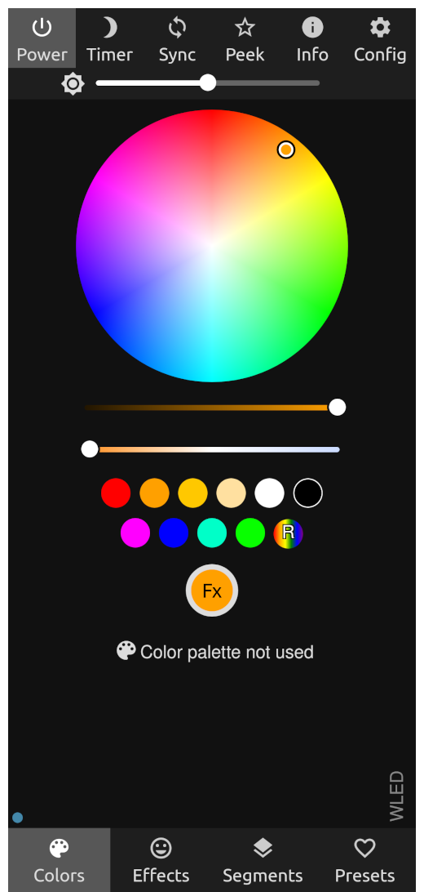

---

---

#### The top bar

The top bar has a few buttons for quick and easy access to WLED functions.

---

##### Power

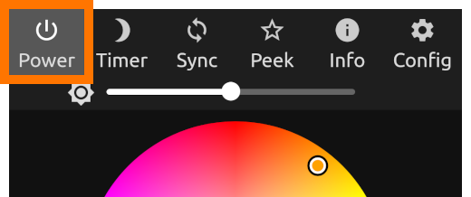

The power button does exactly what you think. Press it to toggle your light on or off.

---

##### Timer

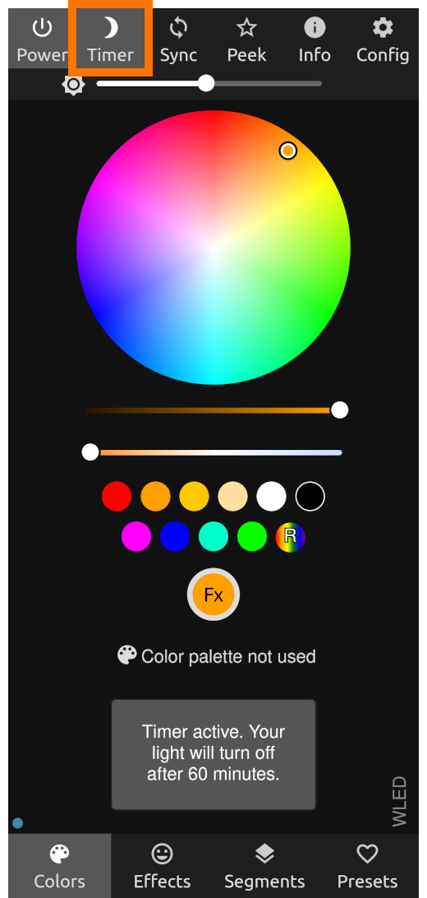

The timer button activates a timer that will slowly fade off your light over 60 minutes. The length of time and way it fades can be configured under LED Preferences.

---

##### Sync

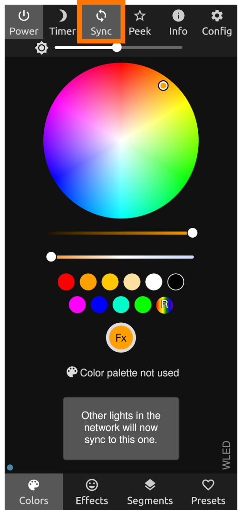

This button is a quick way to toggle the WLED's built-in sync functionality (WLED UDP Sync).
By default the light you click the button from becomes the sender, and any other WLED lights on the same network will recieve brightness, color, and effect changes from this sender.

---

##### Peek

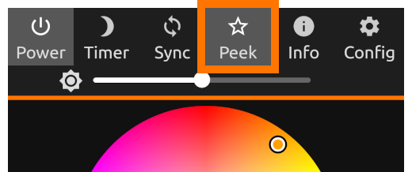

The peek button shows a live preview of your light strip displayed in a line at the top of the screen.

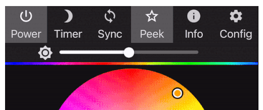

---

##### Info

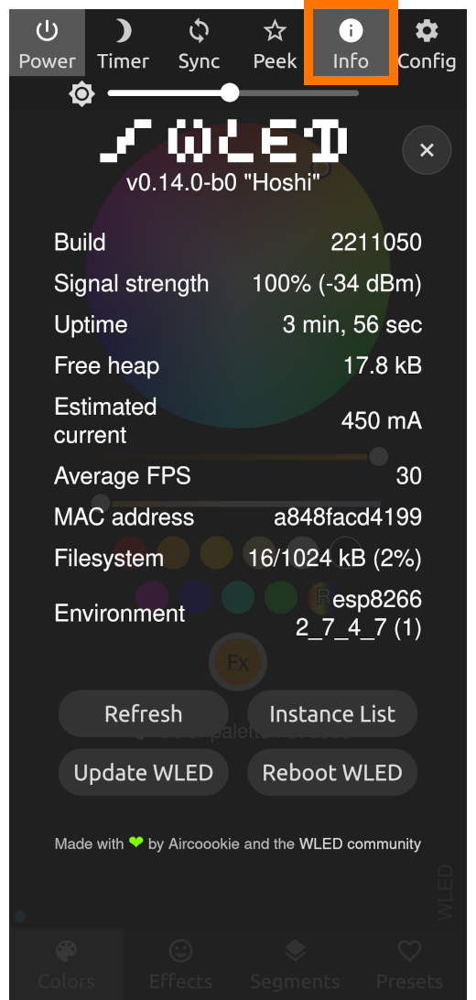

The info button brings up an overlay that shows some statistics and info that may be useful for troubleshooting.  
Below the info listed, there are four buttons.

- The **Refresh button** refreshes the info listed above it.  
- The **Instance List** button shows all of the other WLED lights that have been auto-discovered by the light. You can click on the name of that instance to control it.  
- The **Update WLED** button brings you to the update page so you can check to see if your firmware is up to date, or download and install the latest firmware.  
- The **Reboot WLED** is a fast and easy way to reboot your WLED light.

<table>
  <tr>
    <th>Info label</th>
    <th>Explaination</th>
  </tr>
  <tr>
    <td>Build</td>
    <td>The specific build ID of your current firmware.</td>
  </tr>
  <tr>
    <td>Signal strength</td>
    <td>The lights wifi strength.</td>
  </tr>
  <tr>
    <td>Uptime</td>
    <td>How long the light has been powered on.</td>
  </tr>
  <tr>
    <td>Free heap</td>
    <td>(???)</td>
  </tr>
  <tr>
    <td>Estimated current</td>
    <td>And estimation of how much power the light is consuming. This is only available if the automatic brightness limiter is enabled.</td>
  </tr>
  <tr>
    <td>Average FPS</td>
    <td>The average frames per second that the animations are being displayed on the light.</td>
  </tr>
  <tr>
    <td>MAC address</td>
    <td>The MAC address of your light.</td>
  </tr>
  <tr>
    <td>Filesystem</td>
    <td>(Amount of free memory?)</td>
  </tr>
  <tr>
    <td>Environment</td>
    <td>(The device type of the hardware/firmware?)</td>
  </tr>
</table>

---

##### Config

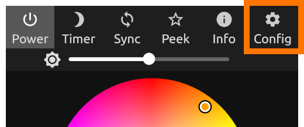

The config button brings up a menu to different pages where you can configure various settings for your light.

Each page of the configuration menu is explained here: **(don't forget to link to the page that I haven't created yet...)**

---

##### Brightness

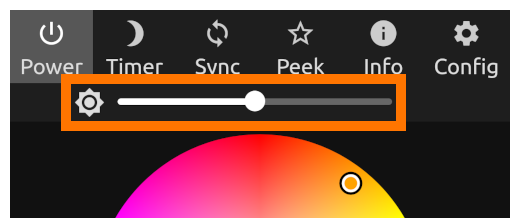

The brightness slider is a quick and easy way to adjust brightness of your light.  
Think of it as the master brightness control of your light.

---

---

#### The bottom bar

The bottom bar has four different buttons that take you to four different pages that you can use to control your light.

---

##### Colors

The colors screen is where you choose the colors for the different effects playing on your light.

###### The Color picker

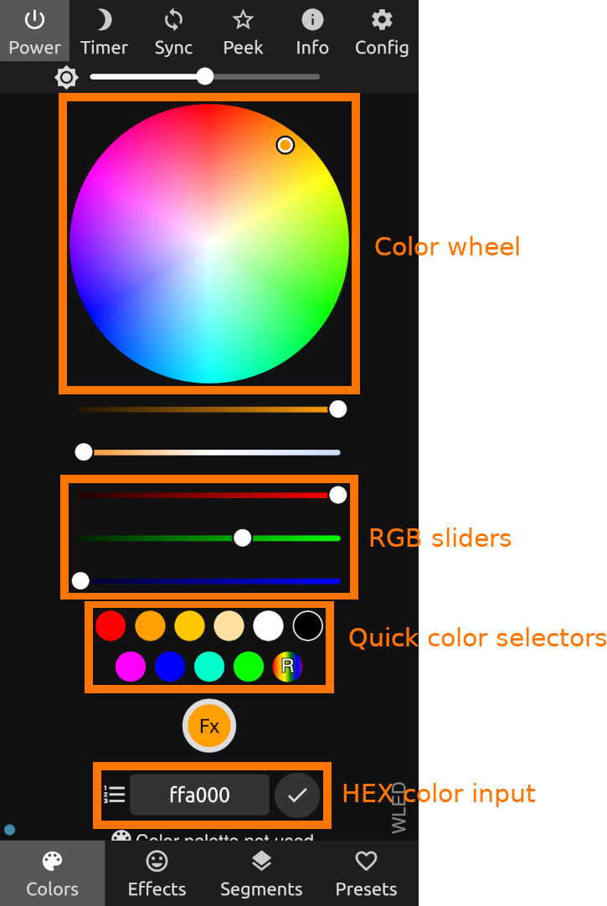

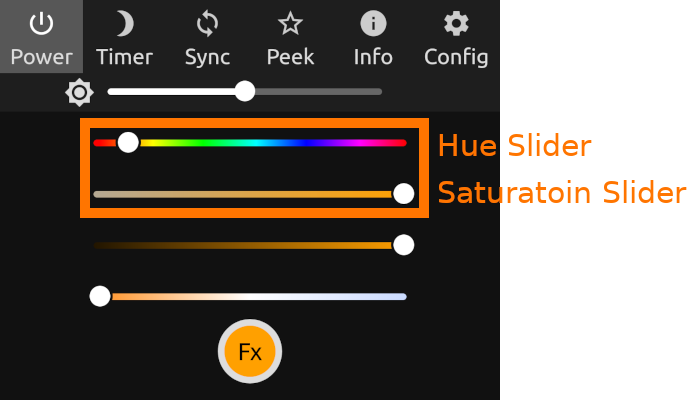

###### Color palettes

---

##### Effects

---

##### Segments

---

##### Presets

